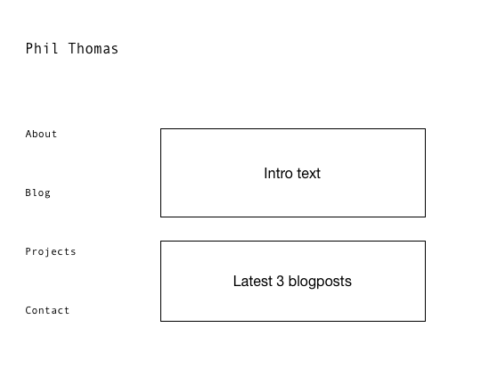
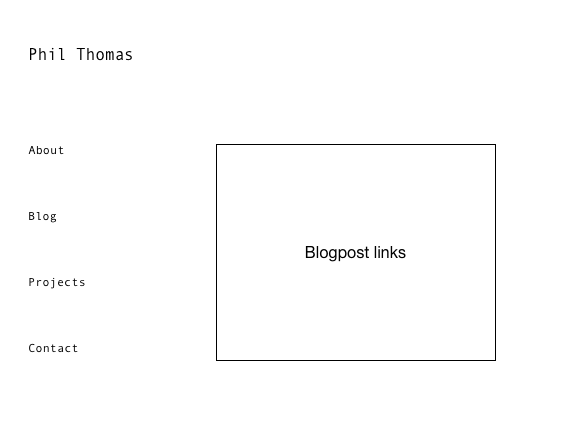

What is a wireframe?

A wireframe is a mockup of a webpage's design features.

What are the benefits of wireframing?

You can sketch out and share ideas for the look and feel of a webpage without having to deal with code.

Did you enjoy wireframing your site?

Yes, I've done it professionally before and I think it's one of the most fun aspects of web development.

Did you revise your wireframe or stick with your first idea?

No, I had a pretty good idea of what I wanted to do with my site.

What questions did you ask during this challenge? What resources did you find to help you answer them?

I've done this before so I didn't have too many questions. The only thing is I decided to use a new application for wireframing this time so I needed to go over its documentation a bit to get the hang of it.

Which parts of the challenge did you enjoy and which parts did you find tedious?

I think wireframing is fun so this was mostly enjoyable. The only thing slightly tedious (but necessary for learning) was going through the whole git committing process.
