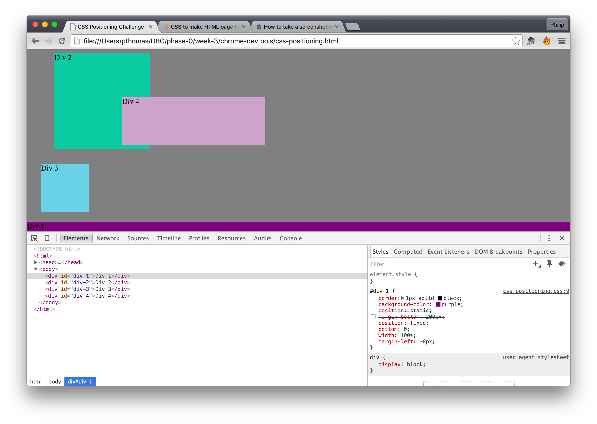

How can you use Chrome's DevTools inspector to help you format or position elements?

The Devtools inspector allows you to alter the CSS properties of elements. By doing so you can change their format or positioning.

How can you resize elements on the DOM using CSS?

You can set their height and width properties to the desired values by adding or changing the height and width values in the CSS.

What are the differences between absolute, fixed, static, and relative positioning? Which did you find easiest to use? Which was most difficult?

Absolute positioning will move an element anywhere on a page regardless of the position of other objects.

Fixed positioning will keep an element in the same place in the browser window regardless of scrolling.

Static positioning is the default and means the element will display at whatever position it occupies in the document.

Relative positioning allows you to move an element relative to the location it would occupy under static positioning.

Absolute positioning is the easiest to use since it does not require you to keep track of the positions of other elements. Relative positioning is harder because it is reliant on the position the element would occupy relative to its normal location, which in turn is relative to the position of other elements in the document.

What are the differences between margin, border, and padding?

The margin is the spacing between an element and other elements.
The border is the line around the perimeter of the element.
The padding is the spacing between the border and the element content.

What was your impression of this challenge overall? (love, hate, and why?)

It was a fun challenge because it enabled easy experimenting with different CSS properties without the hassle of editing a text file and refreshing the browser window.

Images (PS: some of the images do not have code because my pair had difficulty getting the devtools inspector in the screenshot but we completed all challenges fully)

