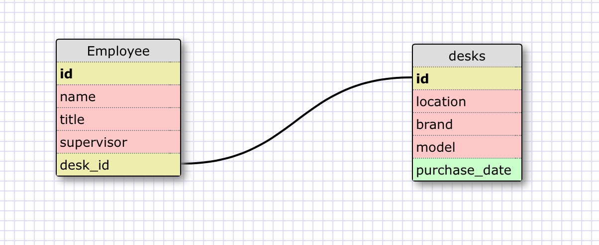
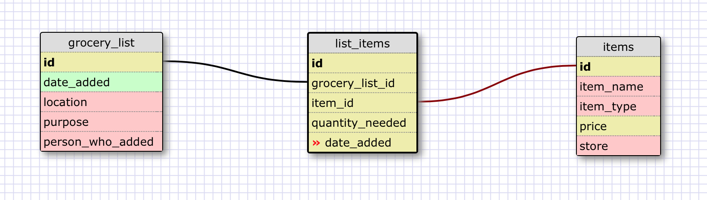

What is a one-to-one database?

A one-to-one database is a database that has tables with one-to-one relationships; i.e. an item in one table corresponds to one, and only one, item in another table.

When would you use a one-to-one database? (Think generally, not in terms of the example you created).

A one-to-one database is helpful when items are being endowed with unique attributes that are not shared with other items.

What is a many-to-many database?

A many-to-many database uses join tables to accommodate the idea that an item in one table may be related to more than one item in another table, and vice versa.

When would you use a many-to-many database? (Think generally, not in terms of the example you created).

A many-to-many database would be useful in any case where it is likely that multiple items in one table will have similar, overlapping relationships with multiple \ items in another table.

What is confusing about database schemas? What makes sense?

Database schemas are easy to understand once you know the underlying concepts. The logical concepts that underly database schemas, though, can be confusing and take time to master.